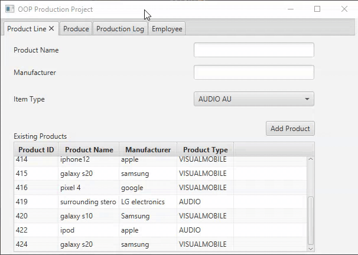
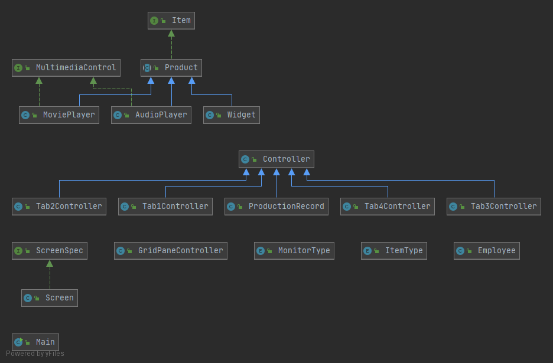
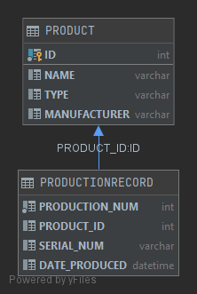

# Object oriented Production Project (OOP)
One paragraph of project description goes here. 

This is my object oriented production project. It is a project that is intended to be used in a big production company as a way to keep track of their big list of products, and their history of production. It has a database for all the products of the company and another database for the actual production history. It also has a tab where the employee on shift has to sign up. This program was made by myself, Ronald Quiroz whith guidence of my college professor Scott Vanselow. I made it over the 2020 Fall semester as a current junior software engineer student of Florida Gulf Coast University (FGCU). I made this program for professor Vanselow's class of object oriented programming(COP 3003) as the biggest assignment of the semester. I've gone thoroughly over the instructions and add some little pieces of code to make the program more user friendly. Between my human user factor changes are: 
1. Feedback messages in the Product Line tab(Tab1). 
2. Clearing the textFields once a product is successfully added, so he user can keep adding more products easily in the Product Line tab.
3. Selecting automatically the most recent product added in the Product Line tab.
4. To avoid errors, the "Record Production" button is unavailable until a product is selected from the listView in the Produce tab (Tab2).
5. Feedback message in Produce Tab for succesfully produced products.
6. A "Refresh" button in the Production Log tab(Tab 3), so if changes are not registered automatically the user still can refresh and see them.
7. Feedback message if there are no changes to report in the Production Log tab after clicking refresh.
8. Help button with instructions for creating a valid name and password in the Employee tab(Tab 4).
9. Feedback messages in the Employee tab(Tab4).
10. A pop-up window to display the Employee information once the name and password are filed and the sign in button is clicked.
11. clearing the textFields once the pop-up window is closed, so another the employee can try again easily.

## Demonstration

Here is an animated gif of the program running, show casing some of its main features.  
   
Here is a link to a longer video showing off some of the changes made taking into consideration human user factor:   
https://youtu.be/RvRmaUMSBEU

## Documentation

Create a docs folder in your project. If using Java, generate JavaDoc in your IDE. If using C++, use Doxygen. Change repository settings (using Settings at top of page) to use GitHub Pages with your docs folder. Add a link to the javadoc/doxygen index.html file with this markdown: \[Text to appear]\(URL)  
The URL will be rjquiroz.github.io/OOP/JavaDoc/index.html   
Do not include the docs folder name in your URL.  
Sample: \[JavaDoc]\(https://pv-cop.github.io/PV-README-TEMPLATE/javadoc/index.html)    
[JavaDoc](https://github.com/rjquiroz/OOP/blob/master/JavaDoc/index.html)

## Diagrams

Such as a class diagram.   
The markdown is  \!\[Alt text\]\(relative/path/to/img.png)  
  
  

## Getting Started

Instructions to get a copy of the project up and running on someone's local machine for development and testing purposes.
 
Note for real project: You want to be able to share your project and enable collaboration. 
 
Note for school project: You want a potential client or hirer to be able to run your program. 

## Built With

* IDE used  
* Other software used  
* Resources used  
 Note for school project: Every section is an opportunity to make an impression. You could briefly add what you know about the IDE and describe your development skills. 

## Contributing

This section is more important for real projects but is good to include in school projects.  
One of the main purposes of GitHub and similar services is to provide a means for project collaboration.  
Tell someone how they can contribute to this project.

## Author

* Your name

## License

[License](LICENSE)  

Public repositories on GitHub are often used to share open source software. For your repository to truly be open source, you'll need to license it so that others are free to use, change, and distribute the software. https://help.github.com/articles/licensing-a-repository/  
You have the option to choose a license when you first create your repository.  
If you need to create a license for an existing repository...
1. Go to your repository.
2. Click on "Create new file" Button.
3. Type the file name as License.txt or License.md in the input box next to your repository name, a drop down button appears towards right side.
4. Choose the type of license of your choice.
5. Click "Commit new file" button at the bottom (Green button)
Credit https://stackoverflow.com/questions/31639059/how-to-add-license-to-an-existing-github-project  
To choose a license, see https://choosealicense.com/ 

## Acknowledgments

* Web sites utilized
* Classmates who helped
* Your professor or TA if they helped

## History

Information about what has changed. 

## Key Programming Concepts Utilized

This section would not necessarily be in a real README.   
It is a reference for you and a place to impress potential employers with your knowledge. 
Identify what concepts you utilize so when you need to use them again you will know that you will find them here. Include a brief description of the concepts in your own words to help you prepare for related interview questions. 
